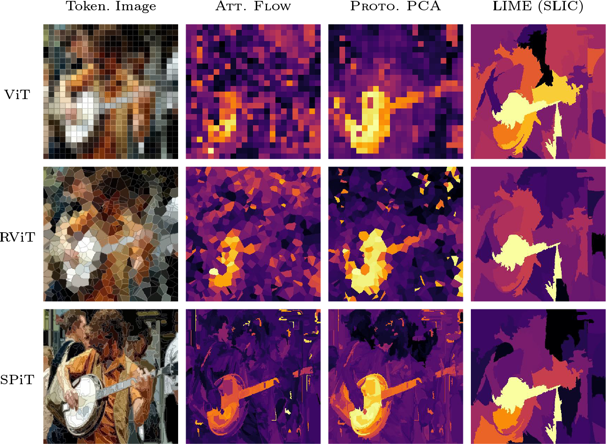
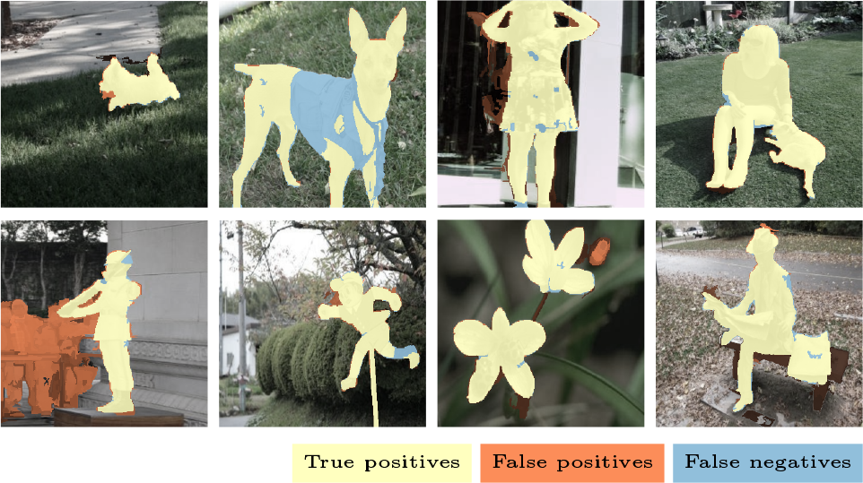
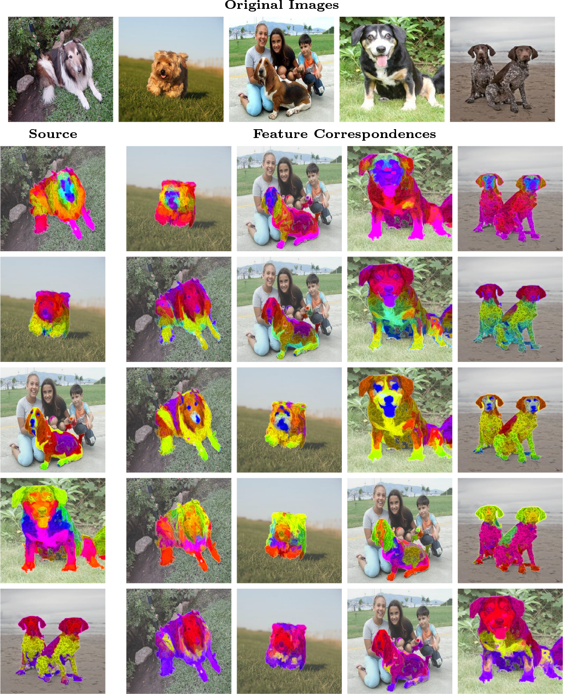

*Figure 1: Tokenized image and attributions from standard Vision Transformer (ViT), a transformer trained with random Voronoi tesselations as tokens (RViT), and our proposed superpixel tokens (SPiT). We use attribution methods inherent in the transformer architecture (Att.Flow), PCA with prototypes (Proto. PCA), and local interpretable model-agnostic explanations LIME using independently computed superpixels using simple linear iterative clustering (SLIC).*


The Vision Transformer (ViT) has largely superseded convolutional neural networks (CNN) for state-of-the-art performance in vision tasks. The ViT applies a novel way of processing images; instead of applying a deep sequence of learnable local convolutional filters, the strategy is instead to partition the image into *square patches* to be treated as *discrete tokens*. These are processed in parallel through *global attention operators*, for which the model learns to share information between tokens optimally for a specific downstream task, e.g. classification. Hence, the ViT represents a move from a focus on local processing to a focus on global processing of spatial data.

Since its introduction, the ViT model has been leveraged successfully for a variety of downstream tasks, including classification, object detection, segmentation, and has been shown to be particularly well suited to self-supervised learning. Importantly, since the transformer architecture is used in language tasks, this allows for multimodality in language and vision.

# Modular Superpixel Tokenization in ViTs

Perhaps due to these successes, less research has been applied towards how the partitioning of images impacts the model. In this work, we explore how more adaptive partitioning which more closely aligns with image content can be applied in the transformer architecture, and we outline a *generalized methodology which allows ViTs to be applied in conjunction with any partitioning*. We propose an effective hierarchical superpixel algorithm optimized for GPU computations. We contrast the superpixel transformer (SPiT) with the canonical patch-based ViT, and include a baseline with randomized partitioning using Voronoi tesselations (RViT).

## Summary of Experiments and Results
We show that ViTs can be successfully trained with alternative tokenization methods in classification tasks, and that *superpixel tokenization provides comparable performance in classification while providing unique benefits in dense prediction tasks*, including explainability, unsupervised segmentation, and feature correspondences. Notably, SPiT provides *improved performance when validated over ImageNet ReaL labels*, designed address the label inaccuracies found in the original ImageNet validation set.

### Attributions and Explainability

Preeminently, the tokenized representations provide high-resolution feature maps, which can be used to extract high-granularity attributions for interpretability and explainability. We provide a quantitative comparison of attribution using metrics of *comprehensiveness* and *sufficiency*, which have been shown to provide *optimal attributions in terms of faithfulness*. We compare attributions extracted using attention-flow and PCA to local interpretable model-agnostic explanations (LIME), selected for being a *strong counterfactual model-agnostic method closely aligning with classical Shapley values*. Our experiments show that *attributions from SPiT provide significantly better comprehensiveness scores than interpretations from LIME*, indicating that SPiT models produce attributions that more effectively exclude irrelevant regions of the image. 

### Unsupervised Segmentation
Superpixels have historically been applied in dense prediction tasks such as segmentation and object detection as a lower-dimensional prior for dense prediction tasks. We are particularly interested in segmentation tasks that does not use a separate decoder head, instead focusing on the direct representations of token embeddings. We evaluate SPiT using normalized graph cuts (TokenCut) on salient segmentation datasets, and show that SPiT outperforms DINO in unsupervised salient segmentation, both with and without post-processing.


*Figure 2: Unsupervised salient segmentation results (`\{0257..0264\}.jpg`) from ECSSD.*


### Feature Correspondances
As a more qualitative evaluation, we examine the consistency of token representations across images. We compute cross attention over normalized features between a source and target images, and visualize the correspondences using a low rank PCA with three channels. We observe that tokenized representations of different classes of dog breeds provide consistent mappings, highlighting parts with similar features with similar colors.


*Figure 3: Feature correspondences from a source image (left) to target images (right), mapped via normalized single head cross attention and colored using low rank PCA.*

### Ablations
Our framework allows us to contrast different tokenization strategies across models by directly swapping tokenizers and evaluating the performance of their model in an ablative experiment. Our results show that ViTs with square patches performs poorly when evaluated on irregular patches from RViT and SPiT. We observe an increase in accuracy for RViT models when evaluated over square patches, and we see that the SPiT models also generalize well to both to square and Voronoi tokens.

Additionally, we verify the quality of our superpixel partitioning method in comparison with state-of-the-art approaches, and show that our method provides high quality superpixels at the fraction of the computational complexity of high-fidelity superpixel methods.

## Conclusion

By positing tokenization as a modular component that generalize the canonical ViT backbone, we show that irregular tokenization with superpixels is commensurable with transformer architectures.

We emphasize that experiments were performed with standard models and training to limit confounding factors in our results, and note that our current results are not significant enough to claim a clear benefit on general purpose classification tasks, but instead produces largely comparable results when evaluated over multiple datasets. 

Attention maps of a transformer can be leveraged to visualize the interactions applied by the model to compute the output, and provides a sound way of extracting explanations for the model predictions, in contrast to gradient-based methods which often lack clear causal links to model predictions. Our results show that superpixel tokenization provide a promising direction for explainable modeling in vision tasks.

Results in unsupervised salient segmentation are noteworthy as SPiT is only pre-trained on a standard classification task over ImageNet1k, as opposed to DINO which is trained with a general purpose self-supervised learning task over a much larger dataset. Further work on applying self-supervised methods, graph neural networks, and a fully learnable framework for tokenization could provide additional benefits of superpixel tokenization across a broader scope of vision-based tasks.


## Citation

```
@inproceedings{Aasan2024,
  title={A Spitting Image: Modular Superpixel Tokenization in Vision Transformers},
  author={Aasan, Marius and Kolbj\ornsen, Odd and Schistad Solberg, Anne and Ram\'irez Rivera, Ad\'in},
  boottitle={{CVF/ECCV} More Exploration, Less Exploitation ({MELEX} {ECCVW})},
  year={2024}
}
```
